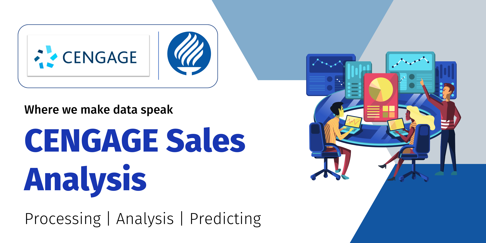

# Data Science: CENGAGE Sales Analysis

In this repo I go over some of the basic steps of The Team Data Science Process lifecycle [here](https://docs.microsoft.com/en-us/azure/architecture/data-science-process/lifecycle) applied to a case study based on a school project lead by CENGAGE.

- [Data Science: CENGAGE Sales Analysis](#data-science-cengage-sales-analysis)
  - [Sampling Techniques](#sampling-techniques)
  - [Data preprocessing and cleaning](#data-preprocessing-and-cleaning)
  - [Regression and Classification](#regression-and-classification)
  - [Cross Validation](#cross-validation)
  - [Results](#results)

## Sampling Techniques

## Data preprocessing and cleaning

## Regression and Classification

## Cross Validation

## Results